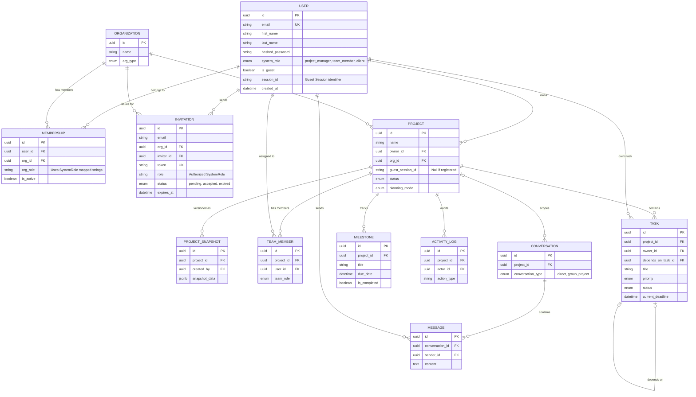
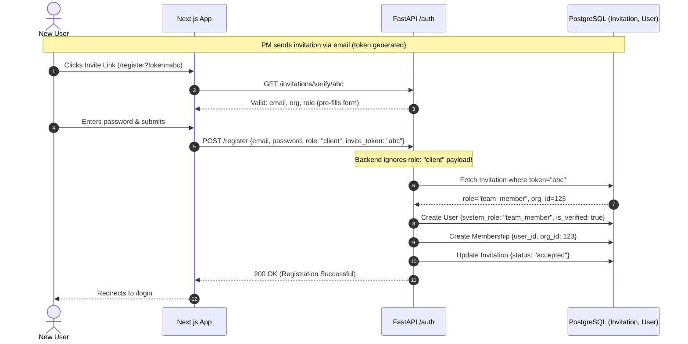
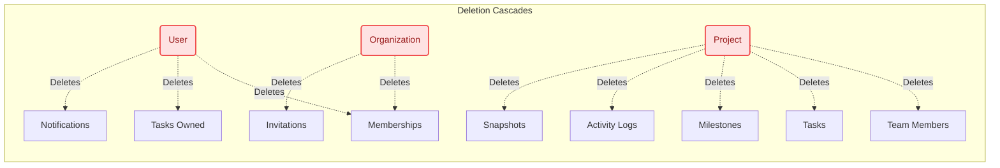

# Fusion-Baukasten Database Schema & Flows
> Comprehensive technical documentation of relations, constraints, and architecture flows.

## 1. Entity Relationship Diagram (ERD)

This diagram visualizes the core PostgreSQL database schema distributed across the three domains: **Stammdaten** (Core Data), **Projekte** (Projects), and **Collab** (Collaboration/Tasks).



---

## 2. Authentication & Security Flows

### 2.1 Standard Registration vs. Invitation Acceptance Flow

This sequence highlights the security check introduced in the audit (C2 patch): when an invite token is provided, the backend forces the user's role to match the database invitation rather than trusting the frontend request.



### 2.2 JWT Token Architecture Flow

To prevent Token Confusion (C3), three distinct types of JWTs are issued. Middleware guarantees tokens cannot be used interchangeably.

```mermaid
flowchart TD
    A[Token Generation] --> B{Action Type}
    
    B -->|User Login| C[token_type: "access"]
    B -->|Forgot Password| D[token_type: "reset"]
    B -->|Register (No Invite)| E[token_type: "verify"]
    
    C --> F((Valid for 7 Days))
    D --> G((Valid for 1 Hour))
    E --> F
    
    F --> H[deps.get_current_user]
    H -->|Requires 'access'| I[Dashboard APIs]
    
    G --> J[reset_password API]
    J -->|Requires 'reset'| K[Update Password]
    
    F --> L[verify_email API]
    L -->|Requires 'verify'| M[Mark User Verified]
    
    %% Error Paths
    G -.->|Attempt to use for Login| H
    H -.-X|401 Unauthorized\n(Token Type Mismatch)| O[Blocked]
    
    C -.->|Attempt to Reset Password| J
    J -.-X|400 Bad Request\n(Token Type Mismatch)| O
```

---

## 3. Core Business Logic & Deletions (Cascades)

Because projects contain significant relational data, deleting a project or user requires strict database constraints. If an entity is deleted, `ondelete="CASCADE"` and SQLAlchemy's `delete-orphan` guarantees the database remains clean.



---

## 4. Platform Access Control Logic

The application relies heavily on `system_role` for authorization and routing.

| Role | Access Level | Data Scoping | Dashboard |
|---|---|---|---|
| **Project Manager** (`project_manager`) | Admin | Sees all projects in Organization, manages team members, sees all conversations, manages milestones. | Project Manager Dashboard |
| **Team Member** (`team_member`) | Contributor | Sees only Projects & Tasks explicitly assigned to them in `TeamMember`. Limited to project-scoped conversations. | Team Member Dashboard |
| **Client** (`client`) | Viewer / Approver | Sees only one single Project. View-only access unless specifically asked to comment/approve. | Client Dashboard |
